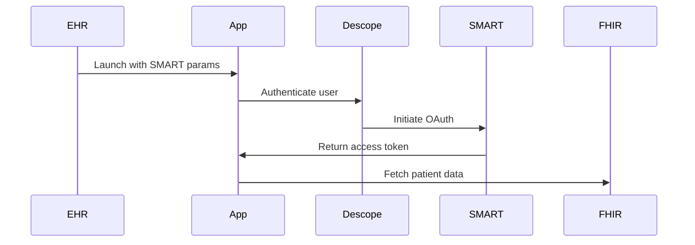

# Diabetes Monitoring App - SMART on FHIR with Descope

A diabetes monitoring application demonstrating integration of Descope authentication with SMART on FHIR to access patient health records from EHR systems.

## Quick Start

### Prerequisites

- Node.js 18+
- Descope account with Inbound Apps enabled
- Access to a SMART on FHIR test server

### Setup

1. **Install dependencies**

```bash
npm install
```

2. **Configure environment variables**

Create a `.env` file:

```env
VITE_DESCOPE_PROJECT_ID=your_project_id
VITE_DESCOPE_FLOW_ID=sign-up-or-in
VITE_FHIR_SERVER_URL=https://launch.smarthealthit.org/v/r4/fhir
VITE_INBOUND_APPS_CLIENT_ID=your_client_id
```

3. **Run the app**

```bash
npm run dev
```

App runs at `http://localhost:3000`

## Testing

### Using SMART Health IT Launcher

1. Go to <https://launch.smarthealthit.org>
2. Set **Launch URL**: `http://localhost:3000/launch.html`
3. Set **Launch Type**: Patient Portal
4. Select a patient and click **Launch**
5. Authenticate with Descope (magic link or SSO)
6. Approve SMART OAuth consent
7. View patient dashboard

### Direct Test

```bash
http://localhost:3000/launch.html?iss=https://launch.smarthealthit.org/v/r4/fhir&launch=test-launch
```

## How It Works



1. **SMART Launch** - EHR provides launch parameters
2. **Descope Auth** - User authenticates (magic link/SSO)
3. **SMART OAuth** - User authorizes data access
4. **Dashboard** - Display patient glucose and medication data

## Project Structure

```
├── public/
│   ├── launch.html     # SMART entry point
│   └── auth.html       # Descope authentication
├── src/
│   ├── components/     # React components
│   ├── services/       # FHIR API client
│   └── App.jsx         # Main app
└── .env
```

## Key Features

- ✅ Descope authentication (magic links, SSO)
- ✅ SMART on FHIR integration
- ✅ OAuth 2.0 with PKCE
- ✅ Patient glucose observations
- ✅ Active medications display

## Resources

- [Descope Documentation](https://docs.descope.com)
- [SMART on FHIR Specification](https://hl7.org/fhir/smart-app-launch/)
- [FHIR R4 Documentation](https://hl7.org/fhir/R4/)

## License

MIT
