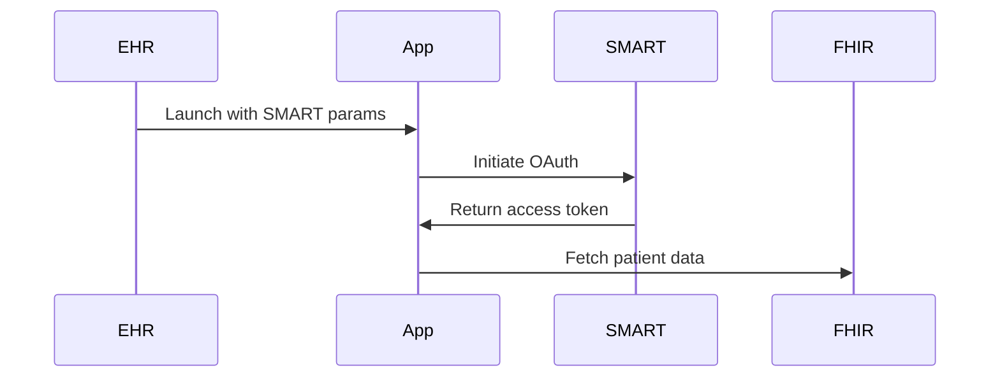

# Diabetes Monitoring App - SMART on FHIR

A diabetes monitoring application using SMART on FHIR to access patient health records from EHR systems.

## Quick Start

### Prerequisites

- Node.js 18+
- Access to a SMART on FHIR test server

### Setup

1. **Install dependencies**

```bash
npm install
```

2. **Run the app**

```bash
npm run dev
```

App runs at `http://localhost:3000`

## Testing

### Using SMART Health IT Launcher

1. Go to <https://launch.smarthealthit.org>
2. Set **Launch URL**: `http://localhost:5173/launch.html`
3. Set **Launch Type**: Patient Portal
4. Select a patient and click **Launch**
5. Approve SMART OAuth consent
6. View patient dashboard

### Direct Test

```bash
http://localhost:5173/launch.html?iss=https://launch.smarthealthit.org/v/r4/fhir&launch=test-launch
```

## How It Works



1. **SMART Launch** - EHR provides launch parameters
2. **SMART OAuth** - User authorizes data access
3. **Dashboard** - Display patient glucose and medication data

## Project Structure

```
├── public/
│   └── launch.html     # SMART entry point
├── src/
│   ├── components/     # React components
│   ├── services/       # FHIR API client
│   └── App.jsx         # Main app
└── package.json
```

## Key Features

- ✅ SMART on FHIR integration
- ✅ OAuth 2.0 with PKCE
- ✅ Patient glucose observations
- ✅ Active medications display
- ✅ Mock data fallback for testing

## Resources

- [SMART on FHIR Specification](https://hl7.org/fhir/smart-app-launch/)
- [FHIR R4 Documentation](https://hl7.org/fhir/R4/)
- [SMART Health IT Launcher](https://launch.smarthealthit.org)

## License

MIT
