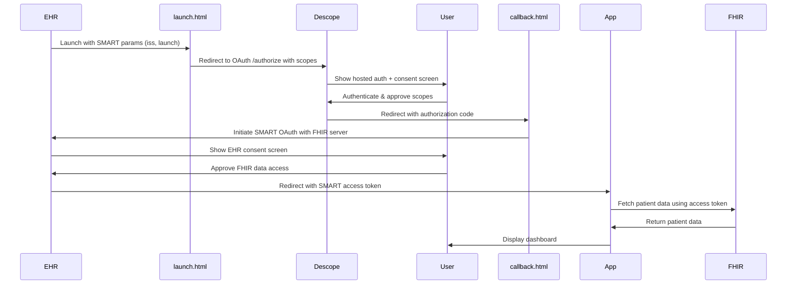

# Diabetes Monitoring App - SMART on FHIR with Descope

A diabetes monitoring application demonstrating integration of Descope authentication with SMART on FHIR to access patient health records from EHR systems.

## Quick Start

### Prerequisites

- Node.js 18+
- Descope account with Inbound Apps enabled
- Access to a SMART on FHIR test server

### Setup

1. **Install dependencies**

```bash
npm install
```

2. **Configure Descope Inbound App**

In your Descope console:

- Create an Inbound App for SMART on FHIR
- Set the **Redirect URI** to: `http://localhost:3000/callback.html`
- Note your **Client ID**

3. **Update configuration**

Edit `public/config.js` with your Descope values:

```javascript
window.DESCOPE_CONFIG = {
    projectId: 'YOUR_PROJECT_ID',
    inboundAppClientId: 'YOUR_INBOUND_APP_CLIENT_ID',
    scopes: [
        'openid',
        'patient/Observation.read',
        'launch',
        'patient/MedicationRequest.read'
    ]
};
```

4. **Configure environment variables** (optional)

Create a `.env` file:

```env
VITE_DESCOPE_PROJECT_ID=your_project_id
VITE_FHIR_SERVER_URL=https://launch.smarthealthit.org/v/r4/fhir
```

5. **Run the app**

```bash
npm run dev
```

App runs at `http://localhost:3000`

## Testing

### Using SMART Health IT Launcher

1. Go to <https://launch.smarthealthit.org>
2. Set **Launch URL**: `http://localhost:3000/launch.html`
3. Set **Launch Type**: Patient Portal
4. Select a patient and click **Launch**
5. Authenticate with Descope Hosted Auth (you'll see the consent screen with scopes)
6. Approve the consent screen showing the requested scopes:
   - `patient/Observation.read`
   - `patient/MedicationRequest.read`
   - `launch`
7. Approve SMART OAuth consent from the EHR
8. View patient dashboard with real FHIR data

### Direct Test

```bash
http://localhost:3000/launch.html?iss=https://launch.smarthealthit.org/v/r4/fhir&launch=test-launch
```

## How It Works


```mermaid
sequenceDiagram
    EHR->>launch.html: Launch with SMART params (iss, launch)
    launch.html->>Descope: Redirect to OAuth /authorize with scopes
    Descope->>User: Show hosted auth + consent screen
    User->>Descope: Authenticate & approve scopes
    Descope->>callback.html: Redirect with authorization code
    callback.html->>EHR: Initiate SMART OAuth with FHIR server
    EHR->>User: Show EHR consent screen
    User->>EHR: Approve FHIR data access
    EHR->>App: Redirect with SMART access token
    App->>FHIR: Fetch patient data using access token
    FHIR->>App: Return patient data
    App->>User: Display dashboard
```

1. **SMART Launch** - EHR provides launch parameters (`iss`, `launch`)
2. **Descope OAuth** - Redirect to Descope's OAuth authorize endpoint with requested scopes
3. **Descope Auth & Consent** - User authenticates and sees consent screen with scopes
4. **OAuth Callback** - Descope redirects back with authorization code
5. **SMART OAuth** - App initiates OAuth flow with EHR FHIR server
6. **EHR Authorization** - User authorizes FHIR data access
7. **Dashboard** - Display patient glucose and medication data from FHIR API

## Project Structure

```
├── public/
│   ├── config.js       # Descope configuration
│   ├── launch.html     # SMART entry point
│   └── callback.html   # OAuth callback handler
├── src/
│   ├── components/     # React components
│   ├── services/       # FHIR API client
│   └── App.jsx         # Main app
└── .env
```

## Key Features

- ✅ Descope Hosted Auth with consent screen showing scopes
- ✅ SMART on FHIR integration
- ✅ OAuth 2.0 with PKCE
- ✅ Granular FHIR scopes (patient/Observation.read, patient/MedicationRequest.read)
- ✅ Patient glucose observations
- ✅ Active medications display
- ✅ Proper OAuth flow with authorization code exchange

## Resources

- [Descope Documentation](https://docs.descope.com)
- [SMART on FHIR Specification](https://hl7.org/fhir/smart-app-launch/)
- [FHIR R4 Documentation](https://hl7.org/fhir/R4/)

## License

MIT
